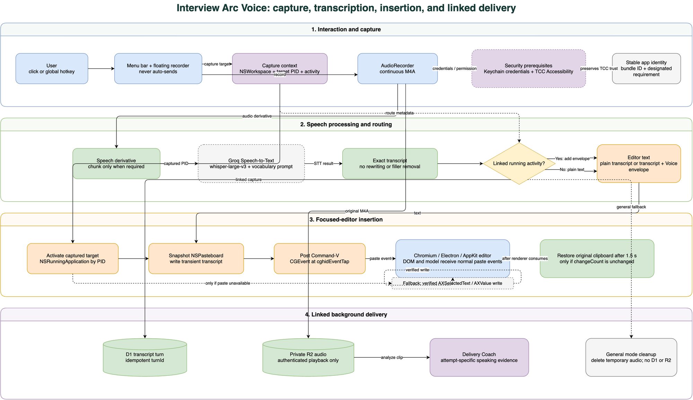
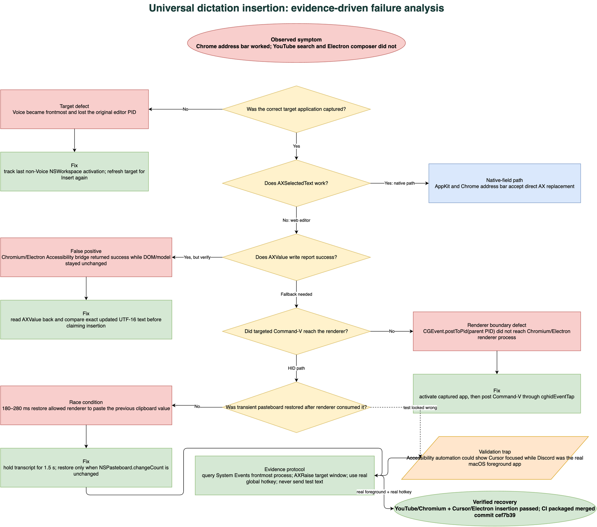

# Universal Dictation Insertion Failure and Recovery

- **Status:** Resolved and user-verified
- **Incident window:** July 22–23, 2026 (Pacific time)
- **Affected product:** Interview Arc Voice for macOS
- **Impact level:** High — the product's primary dictation workflow was unreliable
- **Data loss:** None observed
- **Unintended message submission:** None; Voice never presses Send
- **Primary repair:** Pull request [#7](https://github.com/Vinosaamaa/interview-arc-voice/pull/7), merge commit
[`cef7b39`](https://github.com/Vinosaamaa/interview-arc-voice/commit/cef7b39f2411b85410c437292053515ae1441de7)

## Executive summary

Interview Arc Voice could record and transcribe speech, but it could not
reliably insert that transcript into every intended macOS editor. The clearest
symptom was asymmetric behavior: dictation worked in Chrome's address bar while
failing in a YouTube search field, Codex/ChatGPT-style composers, and
Electron-based editors.

This was not one isolated defect. It was a chain of independently plausible
assumptions that failed at application boundaries:

- opening Voice changed the foreground application and lost the original target;
- macOS Accessibility (AX) calls could report success even when a Chromium or
  Electron editor's DOM or internal model did not change;
- a keyboard event posted to a browser's parent PID did not necessarily reach
  its renderer process;
- restoring the pasteboard after 180–280 milliseconds raced the renderer, which
  sometimes pasted the previous clipboard value; and
- our first UI automation checks could focus an Accessibility element without
  making that application the real macOS foreground process.

The final repair captures the last non-Voice application PID, activates that
application before insertion, uses a real Command-V event posted through the
global HID event stream, keeps the transient transcript on the pasteboard for
1.5 seconds, and restores the previous pasteboard only if
`NSPasteboard.changeCount` proves that no other owner changed it. Direct AX
replacement remains a fallback, but it is accepted only after exact read-back
verification.

The repaired path was verified in Chromium/YouTube and Cursor/Electron with the
real global hotkey. The user then confirmed the actual target workflow was
working. No test message was sent; test text was removed before verification
ended.

## Scope and user impact

The incident affected both Voice modes:

- **General dictation:** speech could be transcribed and shown in Voice's last
  transcript area but fail to appear in the selected editor.
- **Linked Interview Arc capture:** transcription, D1/R2 work, and delivery
  analysis could proceed while the visible specialist composer still received
  no text.

Additional defects discovered during the same stabilization period made the
failure appear broader:

- the packaged app could appear to quit during launch;
- macOS repeatedly requested Accessibility permission;
- linked mode could retain a stale, no-longer-running activity;
- the UI could falsely report that the Groq key was missing;
- the previously focused editor could be replaced by Voice itself as the
  insertion target; and
- the initial test harness sometimes reported an insertion failure even though
  it had never made the intended application foreground.

No raw transcript or API key was committed. General-dictation audio remained
temporary. Linked audio remained private. Voice did not automatically send a
message or mutate a reusable Problem Bank solution.

## Adjacent design decisions stabilized during the repair

The debugging work also clarified several product boundaries that must remain
stable. These were not all root causes, but changing them while repairing
insertion would have made the incident harder to reason about.

| Decision | Durable behavior |
|---|---|
| Capture modes | **Link to Interview Arc** is on by default, but can be disabled for ordinary system-wide dictation |
| Activity identity | Only an activity with a running timer is linkable; the activity is frozen at recording start |
| Review boundary | Voice inserts text but never presses Send |
| Transcription engine | Groq `whisper-large-v3` is primary; local Whisper remains a future fallback |
| Vocabulary | Activity metadata selects deterministic, bounded terminology packs; no per-recording LLM decides the prompt |
| Transcript fidelity | Preserve the raw/verbatim transcript; do not rewrite or remove fillers |
| Long recordings | Chunk only the transcription derivative when needed; keep the original audio continuous |
| Multiple stops | Each stop creates its own clip and `turnId`; several clips can remain associated with one activity/visible answer |
| Duplicate prevention | A hidden `interview-arc-voice:v1` Markdown envelope tells the specialist that the visible turn already exists in D1 |
| Linked storage | Original audio goes to private R2, owner-scoped turn/clip metadata goes to D1, and Delivery Coach runs asynchronously |
| General storage | Temporary audio is deleted; no D1, R2, specialist, or Delivery Coach mutation occurs |
| Status indicators | Text insertion, R2 upload, and coaching are separate stages; background work may remain in progress after text appears |
| Menu UI | The menu panel remains 260 points wide |
| Floating UI | The always-on-top recorder remains a 250-by-40-point capsule and shows a live waveform while recording |
| Shortcut | `Control-Option-Space` starts/stops recording and exercises the same target-capture path as the visible controls |

This separation matters operationally. For example, a blue/in-progress coaching
indicator after green text and R2 indicators is not an insertion failure; it
means the asynchronous Delivery Coach stage has not yet finalized. Conversely,
a transcript visible only in Voice's “last transcript” area is an insertion
failure even if STT succeeded.

## Intended system architecture

The source diagram is
[`assets/voice-insertion-architecture.drawio`](assets/voice-insertion-architecture.drawio).

The architecture has four independently observable stages:

1. **Interaction and capture** — the menu bar, floating recorder, or global
   shortcut records one continuous M4A and captures the foreground target.
2. **Speech processing and routing** — Groq `whisper-large-v3` returns the exact
   transcript, and the current running activity determines whether a Voice
   envelope is added.
3. **Focused-editor insertion** — Voice reactivates the captured app, dispatches
   a paste event that native and renderer-backed editors understand, and
   restores clipboard state safely.
4. **Linked background delivery** — D1 stores the idempotent transcript turn,
   R2 stores private audio, and Delivery Coach stores attempt-specific speaking
   evidence. General mode skips these stores and deletes temporary audio.

The visible editor remains the review and submission boundary in both modes.

## Symptom matrix

| Surface | Observed behavior before repair | What it revealed |
|---|---|---|
| Chrome address bar | Transcript inserted | Native/AX-backed text fields accepted direct replacement |
| YouTube search | Transcript absent | Chromium `contenteditable` behavior differed from the browser chrome |
| Cursor composer | Transcript absent until foreground activation and real hotkey | Electron renderer plus foreground targeting mattered |
| Voice last-transcript UI | Transcript present | Recording and STT were healthy; failure was downstream |
| Linked activity display | Could show an old activity | Context was refreshed too infrequently |
| Connection status | Could say “Add your Groq key” despite a working key | Background state overwrote credential-derived readiness |
| App launch | Keychain prompt followed by no visible app | startup work ran before a visible failure surface existed |
| Accessibility prompt | Reappeared after some rebuilds/installations | macOS TCC identity was not stable across app copies/signatures |

## Timeline

Times below use UTC to match GitHub's audit trail; the final merge occurred on
July 23 in Pacific time.

| Time | Event |
|---|---|
| 2026-07-22 08:54 | PR [#2](https://github.com/Vinosaamaa/interview-arc-voice/pull/2) merged. It prevented the packaged vocabulary-resource crash, presented UI before Keychain access, added linked/general modes, direct insertion, a stable app identity, a hotkey, and the floating recorder. |
| 2026-07-22 09:34 | PR [#3](https://github.com/Vinosaamaa/interview-arc-voice/pull/3) merged. It added the invisible `interview-arc-voice:v1` Markdown envelope so specialists would not append Voice-managed D1 turns twice. |
| 2026-07-22 21:34 | PR [#4](https://github.com/Vinosaamaa/interview-arc-voice/pull/4) merged. It refreshed activity context every four seconds and immediately before recording, and bound a clip to the activity whose stopwatch was running at capture start. |
| 2026-07-23 20:02 | PR [#5](https://github.com/Vinosaamaa/interview-arc-voice/pull/5) merged. It repaired the false missing-Groq state and remembered the last non-Voice application PID. |
| 2026-07-23 20:26 | PR [#6](https://github.com/Vinosaamaa/interview-arc-voice/pull/6) merged. It introduced a targeted paste fallback and pasteboard snapshot/restore. Address-bar insertion worked, but renderer-backed editors still failed intermittently. |
| 2026-07-23–24 | PR #7 iterated through AX read-back, empty-editor handling, global paste dispatch, and pasteboard timing fixes. |
| 2026-07-24 05:25 | PR [#7](https://github.com/Vinosaamaa/interview-arc-voice/pull/7) merged after successful CI and live Chromium/Electron verification. |
| 2026-07-23 Pacific | The merged application was packaged, installed as the only app copy, code-signature checked, and user-verified in the actual workflow. |

### Repair commits inside PR #7

| Commit | Purpose |
|---|---|
| `af4f309` | Route paste toward the captured focused editor |
| `5f6827d` | Attempt editable AX value insertion |
| `c8a041f` | Keep Voice UI responsive while Keychain loads |
| `6d3901b` | Handle empty Chromium editors |
| `935b993` | Repair the Chromium insertion build |
| `fe39850` | Verify AX value writes instead of trusting the return code |
| `e0b4f60` | Prefer real paste events for renderer-backed editors |
| `d13a95c` | Wait for the renderer before restoring the pasteboard |

## Root-cause analysis

### Primary cause

The insertion subsystem treated “focused editable control” as a uniform macOS
concept. It is not uniform.

An AppKit text field, Chrome's native address bar, a Chromium web
`contenteditable`, a React-controlled composer, and an Electron/Monaco-style
editor can expose superficially similar AX attributes while using different
event and state models. A direct AX mutation may update an Accessibility proxy
without producing the keyboard/input/paste events that a web framework uses to
update its DOM or application model.

### Contributing causes

1. **Target capture happened across a focus-changing UI.** Clicking the Voice
   menu or recorder made Voice foreground. Looking up the current app after that
   point selected Voice, not the editor.
2. **AX return codes were treated as proof.**
   `AXUIElementSetAttributeValue` returning `.success` proves the bridge accepted
   the request; it does not prove the editor's model now contains the text.
3. **Events were posted at the wrong process boundary.** A Chromium/Electron
   browser process and its renderer are separate processes. Posting Command-V
   to the parent PID did not reliably deliver a normal paste event to the
   renderer.
4. **Pasteboard restoration was too fast.** Renderer consumption is
   asynchronous. Restoring after 180–280 ms let the renderer observe the old
   clipboard value.
5. **The test harness conflated AX focus and foreground ownership.** An
   Accessibility automation tool could show Cursor's composer as focused while
   System Events still reported Discord as the actual foreground application.
6. **Coverage stopped below the real application boundary.** Unit tests covered
   deterministic vocabulary resolution, but no signed-app integration test
   exercised native, Chromium, and Electron editors with real macOS
   Accessibility permission.

## Five Whys

### Why did the transcript not appear in web and Electron editors?

1. Because the editor did not receive an input operation it recognized.
2. Because Voice first relied on AX replacement and then on a targeted
   Command-V sent to a parent process.
3. Because the implementation assumed an AX success result or parent-PID event
   was equivalent to a user paste.
4. Because testing began with a native browser field where that assumption
   happened to hold.
5. Because the acceptance matrix did not initially distinguish native AppKit,
   browser chrome, Chromium renderer, and Electron renderer surfaces.

### Why did the renderer sometimes paste the previous clipboard value?

1. Because Voice restored the pasteboard before the renderer consumed it.
2. Because the initial wait was based on a short fixed delay.
3. Because renderer event handling is asynchronous and varies with application
   load.
4. Because there was no evidence-based ownership guard around restoration.
5. Because the original design requirement incorrectly said the clipboard
   would never be used, so transient pasteboard behavior was not designed as a
   first-class protocol.

### Why did testing initially say Electron still failed?

1. Because the visible/AX-focused Cursor field was not in the actual foreground
   application.
2. Because Discord still owned macOS foreground focus.
3. Because the automation path changed AX focus without reproducing a user's
   full activation sequence.
4. Because the test asserted field state but did not assert the frontmost
   process.
5. Because foreground ownership was missing from the test protocol.

## Evidence-driven failure tree

The source diagram is
[`assets/voice-insertion-failure-analysis.drawio`](assets/voice-insertion-failure-analysis.drawio).

## Detailed issue catalog

### 1. Packaged app appeared to launch and immediately quit

- **Symptom:** the user selected the app, answered a Keychain prompt, and saw no
  window or menu-bar item.
- **Cause:** a packaged vocabulary resource could crash startup, and Keychain
  work occurred before the UI had presented a durable error surface.
- **Repair:** validate bundled vocabulary resources, present the menu/floating
  UI first, and load Keychain state in detached background work.
- **Lesson:** startup dependencies must fail into visible, recoverable state.

### 2. Accessibility permission repeatedly reappeared

- **Symptom:** macOS repeatedly opened Privacy & Security even after permission
  was granted.
- **Cause:** multiple app copies or changing local code-signing identities can
  create different designated requirements in TCC's view.
- **Repair:** keep one installed app copy, one bundle ID
  (`app.interviewarc.voice`), and a stable designated requirement across
  packages.
- **Lesson:** for a permission-sensitive macOS tool, signing identity is runtime
  state, not merely release metadata.

### 3. Linked mode followed a stale activity

- **Symptom:** Voice still displayed a system-design activity after every
  activity timer had stopped.
- **Cause:** activity focus was read at launch/manual refresh rather than tied
  to a currently running stopwatch.
- **Repair:** poll context every four seconds, refresh again immediately before
  recording, and capture the running activity at recording start.
- **Lesson:** link state is a lease over live activity, not a cached label.

### 4. The UI falsely requested a Groq key

- **Symptom:** refresh said “Add your Groq key” even though transcription still
  worked and the secret existed in Keychain.
- **Cause:** a background activity/context refresh overwrote a broader ready
  state that had been derived from secure credential state.
- **Repair:** keep credential readiness and activity readiness separate; do not
  let an unrelated refresh erase the credential snapshot.
- **Lesson:** model status as independent state dimensions rather than one
  mutable status string.

### 5. Voice lost the intended destination

- **Symptom:** insertion worked inconsistently depending on whether the user
  invoked Voice from its own UI or the global shortcut.
- **Cause:** Voice became foreground before the insertion target was resolved.
- **Repair:** observe `NSWorkspace` application activations, remember the last
  non-Voice PID, capture it when recording begins, and refresh it for
  **Insert again**.
- **Lesson:** capture identity before opening a focus-stealing control.

### 6. Chrome address bar worked while YouTube search did not

- **Symptom:** a native browser-chrome field accepted dictation, but a page
  editor did not.
- **Cause:** direct `kAXSelectedTextAttribute` replacement was sufficient for
  the native field; Chromium's renderer-backed editor expected a real paste or
  input event.
- **Repair:** make the real paste-event path the primary cross-editor strategy.
- **Lesson:** success in one field inside an application does not validate every
  editor technology inside that application.

### 7. AX value mutation produced a false positive

- **Symptom:** the AX API returned success, but the visible editor was unchanged.
- **Cause:** the Accessibility bridge accepted the value while the editor's DOM
  or controlled model rejected or ignored it.
- **Repair:** construct the exact expected UTF-16 result, write it, read
  `kAXValueAttribute` back, and accept success only on an exact match.
- **Lesson:** verify postconditions; never use transport-level success as
  application-level success.

### 8. Targeted Command-V missed Chromium/Electron renderers

- **Symptom:** `CGEvent.postToPid(parentPID)` did not insert into renderer-backed
  fields.
- **Cause:** the event was aimed at the browser/application parent process, not
  delivered as a normal foreground hardware event to the renderer.
- **Repair:** activate the captured `NSRunningApplication` and post Command-V
  through `.cghidEventTap`.
- **Lesson:** cross-process GUI automation must reproduce the operating system's
  normal event-routing conditions.

### 9. Pasteboard restoration raced the renderer

- **Symptom:** the editor sometimes received the clipboard value that existed
  before dictation.
- **Cause:** the renderer had not consumed the transient transcript before Voice
  restored the snapshot.
- **Repair:** retain the transcript for 1.5 seconds and restore only if
  `NSPasteboard.changeCount` is unchanged.
- **Lesson:** asynchronous consumers require both sufficient lifetime and an
  ownership check. A timeout alone is not safe.

### 10. The validation harness had the wrong foreground app

- **Symptom:** Cursor's composer appeared AX-focused, but the global hotkey test
  failed.
- **Cause:** Discord was still the actual macOS foreground process.
- **Repair:** query System Events for the frontmost process, use `AXRaise`, make
  the target app frontmost, invoke the real global hotkey, never press Send, and
  clear inserted test text.
- **Lesson:** “focused element” and “frontmost application” are distinct
  assertions.

### 11. Local tooling could not fully reproduce release builds

- **Symptom:** the local Swift command-line toolchain produced SDK/compiler
  mismatch failures, and sandboxed unified logging was unavailable.
- **Response:** use privacy-safe `os.Logger` instrumentation, visible state
  inspection, process queries, and GitHub's Xcode-backed macOS CI for the signed
  package.
- **Lesson:** document which evidence came from local parsing, CI, packaged-app
  tests, and live UI tests; do not silently substitute one for another.

### 12. Existing documentation contradicted the shipped repair

- **Symptom:** README, architecture, and agent instructions said Voice “never
  uses the clipboard.”
- **Cause:** that statement described an early design goal, not the only
  reliable behavior for renderer-backed editors.
- **Repair:** document the actual invariant: no manual clipboard workflow, no
  transcript left on the clipboard, snapshot/restore guarded by
  `changeCount`, and no automatic Send.
- **Lesson:** safety requirements should specify the protected outcome rather
  than forbid an implementation mechanism that may be necessary.

## Approaches attempted and why they were insufficient

| Attempt | Why it looked reasonable | Why it failed or was incomplete |
|---|---|---|
| Direct `AXSelectedText` replacement | Native text controls expose selection replacement | Web/Electron controls may not translate it into DOM/model input |
| Whole-value `AXValue` replacement | Some editors expose a settable value | The bridge could report success while the editor stayed unchanged |
| Unicode keyboard events | Avoided pasteboard use | Complex editors and shortcuts did not consistently accept the synthetic text stream |
| `CGEvent.postToPid` Command-V | Targeted the captured application directly | Browser parent PID was not the renderer event boundary |
| Restore pasteboard after 180–280 ms | Kept clipboard disruption short | Renderer consumption could occur later, producing a race |
| Trust Accessibility automation focus | The intended editor appeared focused | It did not prove that the app was macOS frontmost |
| Test only Chrome's address bar | Fast smoke test in a common app | It validated browser chrome, not a Chromium page editor |
| Refresh activity only at launch/manual action | Minimized API traffic | It allowed stale linkage after timer changes |
| One combined “ready” UI state | Simple view model | Credential, activity, recording, upload, and insertion readiness overwrote one another |

## Final insertion protocol

The production insertion protocol is deliberately conservative:

1. Observe application activation continuously and remember the last non-Voice
   PID.
2. At recording start, freeze the target PID and linked-activity identity.
3. Transcribe without rewriting the user's speech.
4. Activate the captured application.
5. Snapshot every current `NSPasteboard` item and type.
6. Replace the general pasteboard with the transcript (and Voice envelope when
   linked).
7. Record the pasteboard's resulting `changeCount`.
8. Post Command-V at `.cghidEventTap`.
9. Wait 1.5 seconds for asynchronous native, Chromium, or Electron handling.
10. Restore the snapshot only when `changeCount` still equals the value recorded
    by Voice. If another owner changed it, preserve the newer user/application
    data instead.
11. If paste dispatch is unavailable, attempt direct AX replacement and verify
    the exact read-back value.
12. Keep the transcript available for **Insert again** on failure.
13. Never press Send.

## Verification record

| Check | Method | Result |
|---|---|---|
| Diagram/source validation | Draw.io structural validator | Passed |
| Swift/Xcode build and package | GitHub macOS CI run `30069375813` | Passed |
| Chrome/Chromium web editor | YouTube search field, real global hotkey | Passed after 1.5-second pasteboard lifetime |
| Electron editor | Cursor composer, explicit foreground activation, real global hotkey | Passed |
| Actual target workflow | User acceptance test after installation | Passed |
| Automatic Send safety | No Send action invoked; test text cleared | Passed |
| Package identity | Code-signature and exact artifact checks | Passed |
| Vocabulary assets | Packaged app contained 21 vocabulary packs | Passed |

Direct automation of the Codex/ChatGPT composer was not used as the final
machine-driven test because operating that communication surface crossed the
automation safety boundary. Cursor provided an Electron-equivalent editor
surface, and the user supplied the final acceptance evidence in the actual
target.

## What went well

- The transcript remained visible inside Voice, which isolated STT from
  insertion early.
- The user supplied precise differential observations: address bar versus
  YouTube, linked versus unlinked, and earlier working behavior versus current
  failure.
- The implementation preserved the no-auto-send boundary throughout debugging.
- PR-sized repairs kept credential, context, targeting, and insertion changes
  reviewable.
- CI produced an Xcode-backed packaged app when the local Swift toolchain could
  not.
- The final test protocol verified real foreground ownership instead of trusting
  automation appearance.

## What did not go well

- Early fixes optimized an abstraction (“Accessibility text element”) before
  testing the actual editor matrix.
- The “never use clipboard” requirement delayed the reliable paste-event design.
- A success return from AX was accepted without a postcondition check.
- Fixed pasteboard delays were chosen before renderer timing was measured
  behaviorally.
- The app lacked cross-editor integration tests.
- Documentation lagged behind the implementation.
- Multiple partly overlapping failure modes made each incremental fix look like
  a regression in another subsystem.

## Where we were lucky

- No automatic submission path existed, so failed or repeated insertions could
  not send unintended messages.
- The previous pasteboard was snapshotted before the renderer timing issue was
  fully understood.
- No transcript contents were written to diagnostic logs.
- Linked audio had a retry queue, so insertion debugging did not require
  discarding recordings.
- The user detected the clipboard/editor differences before relying on the app
  for a long interview answer.

## Security and privacy analysis

- **Credentials:** Groq and Interview Arc secrets remain in macOS Keychain.
- **Accessibility:** required only to observe/activate the captured target and
  insert text. The stable app identity prevents needless permission churn.
- **Pasteboard:** Voice temporarily owns the general pasteboard to generate a
  normal paste event. It restores the full snapshot only if `changeCount`
  confirms that no other owner modified it.
- **Transcript:** exact text is inserted; no filler removal or AI rewriting.
- **Logs:** stage names and errors may be logged; transcript text must not be.
- **General audio:** temporary and deleted after transcription.
- **Linked audio:** retained locally under Application Support and uploaded only
  to authenticated private R2 storage.
- **D1:** stores owner-scoped turns and metadata. The `turnId` plus hidden
  Markdown envelope provides idempotency when the same visible answer reaches a
  specialist.
- **Submission:** always manual.

## Corrective and preventive actions

### Completed

- [x] Present UI before Keychain loading and move secure reads off the main
  actor.
- [x] Stabilize bundle ID/designated requirement and remove duplicate app copies.
- [x] Refresh running-activity context periodically and immediately before
  recording.
- [x] Separate credential readiness from activity status.
- [x] Capture and reactivate the last non-Voice application PID.
- [x] Use real HID paste events for renderer-backed editors.
- [x] Verify direct AX writes by exact read-back.
- [x] Extend transient pasteboard lifetime to 1.5 seconds.
- [x] Guard restoration with `NSPasteboard.changeCount`.
- [x] Correct the clipboard wording in canonical repository documentation.
- [x] Preserve no-auto-send and privacy invariants.

### P0 — before calling universal insertion complete

- [ ] Add a packaged-app smoke-test checklist covering AppKit, browser chrome,
  Chromium `contenteditable`, Electron, and terminal/editor surfaces.
- [ ] Add stage-level, content-free diagnostics for target capture, app
  activation, paste dispatch, restore outcome, AX fallback, and Insert Again.
- [ ] Add a release acceptance step that asserts both AX-focused element and
  System Events frontmost process.

### P1 — regression automation

- [ ] Create small local fixture apps for native AppKit, WKWebView/Chromium-like,
  and Electron-style editor behavior so tests never depend on production chat
  surfaces.
- [ ] Add pasteboard snapshot/restore tests, including a simulated third-party
  `changeCount` update during the 1.5-second window.
- [ ] Add target-PID tests for menu invocation, floating-recorder invocation,
  global-hotkey invocation, app switching during recording, and **Insert again**.
- [ ] Align the local Swift SDK/toolchain with the Xcode CI environment.

### P2 — observability and maintenance

- [ ] Track privacy-safe insertion-stage latency and failure category locally.
- [ ] Expose a diagnostic bundle that contains versions, permissions, target app
  identity, and stage results—but never credentials, transcript text, or audio.
- [ ] Re-run the editor matrix after every macOS, Electron, or Chromium major
  update.
- [ ] Add this postmortem to release-review and onboarding checklists.

## Future debugging runbook

When “transcription exists but text did not appear” is reported:

1. Confirm the transcript exists in Voice. If not, debug recording/STT rather
   than insertion.
2. Record the capture mode and whether a running Interview Arc timer exists.
3. Confirm Accessibility permission for the one installed signed app.
4. Query the actual macOS frontmost process; do not infer it from the visible
   cursor alone.
5. Confirm the captured PID is not Voice.
6. Test a native field and a renderer-backed field separately.
7. Inspect stage-level logs without printing transcript contents.
8. Verify whether the HID paste event was posted.
9. Verify whether `NSPasteboard.changeCount` changed before restoration.
10. If AX fallback ran, compare the exact expected and read-back values.
11. Use the real global hotkey for the final test.
12. Never press Send; clear the test text after observing insertion.
13. Repackage with the stable identity, replace the single installed app, and
    repeat the matrix.

## Glossary

| Term | Meaning in this incident |
|---|---|
| **AX / Accessibility API** | macOS cross-application UI inspection and control APIs represented by `AXUIElement` |
| **`kAXFocusedUIElementAttribute`** | Attribute used to locate the focused control within an application |
| **`kAXSelectedTextAttribute`** | Attribute that may replace the current selection in a compatible text control |
| **`kAXValueAttribute`** | Accessibility representation of an element's value; it must be read back after mutation |
| **`kAXSelectedTextRangeAttribute`** | Selected text range, represented in this implementation with an `AXValue`/`CFRange` |
| **UTF-16** | String indexing representation used to construct selection edits compatible with macOS text ranges |
| **TCC** | Transparency, Consent, and Control, the macOS privacy-permission system that manages Accessibility grants |
| **PID** | Process identifier captured for the destination application |
| **`NSWorkspace`** | AppKit service used to observe application activation |
| **`NSRunningApplication`** | AppKit representation used to reactivate the captured target |
| **`CGEvent`** | Core Graphics low-level Quartz input event |
| **HID** | Human Interface Device event path; `.cghidEventTap` posts the paste shortcut into the normal system stream |
| **`NSPasteboard`** | macOS shared inter-application data-transfer service used transiently for the paste event |
| **`changeCount`** | Monotonic ownership-change indicator used to avoid overwriting a newer clipboard change |
| **Renderer process** | Separate Chromium/Electron process that owns a web page or editor's DOM and input handling |
| **DOM** | Document Object Model maintained by a web renderer |
| **`contenteditable`** | HTML editing surface that often requires real input/paste events |
| **Electron** | Desktop runtime combining Chromium rendering with a native application shell |
| **React-controlled editor** | Editor whose authoritative text state is managed by React/application logic rather than the DOM alone |
| **Monaco / CodeMirror** | Rich code-editor architectures that may use hidden inputs and application-managed text models |
| **STT** | Speech-to-text transcription |
| **M4A** | MPEG-4 audio container used for the continuous original recording |
| **D1** | Cloudflare SQL storage for owner-scoped transcript turns and metadata |
| **R2** | Cloudflare private object storage for linked original audio |
| **Markdown envelope** | Invisible `interview-arc-voice:v1` comment containing activity/turn identity |
| **Idempotency** | Processing the same Voice-managed turn more than once without duplicating it |
| **CDP** | Chrome DevTools Protocol, used during isolated Chromium inspection |
| **CI** | Continuous integration; GitHub's macOS runner supplied the Xcode-backed build/package evidence |
| **Race condition** | Outcome depending on timing—in this case, renderer paste consumption versus pasteboard restoration |
| **Read-after-write verification** | Reading the AX value after setting it and comparing the exact expected result |
| **Designated requirement** | Code-signing identity rule macOS uses when associating installed app versions with permissions |

## References

- [PR #2: resilient modes and floating controls](https://github.com/Vinosaamaa/interview-arc-voice/pull/2)
- [PR #3: durable Voice capture envelopes](https://github.com/Vinosaamaa/interview-arc-voice/pull/3)
- [PR #4: running-activity linkage](https://github.com/Vinosaamaa/interview-arc-voice/pull/4)
- [PR #5: credential status and target capture](https://github.com/Vinosaamaa/interview-arc-voice/pull/5)
- [PR #6: cross-editor insertion](https://github.com/Vinosaamaa/interview-arc-voice/pull/6)
- [PR #7: web and Electron editor repair](https://github.com/Vinosaamaa/interview-arc-voice/pull/7)
- [Apple: `AXUIElementSetAttributeValue`](https://developer.apple.com/documentation/applicationservices/1460434-axuielementsetattributevalue)
- [Apple: `CGEvent`](https://developer.apple.com/documentation/coregraphics/cgevent)
- [Apple: `CGEvent.post(tap:)`](https://developer.apple.com/documentation/coregraphics/cgevent/post(tap:))
- [Apple: `NSPasteboard`](https://developer.apple.com/documentation/appkit/nspasteboard)
- [Apple: `NSPasteboard.changeCount`](https://developer.apple.com/documentation/appkit/nspasteboard/changecount)
- [Voice architecture](../architecture.md)
- [Voice protocol v1](../protocol-v1.md)

## Ownership

The Interview Arc Voice maintainers own the P0–P2 actions. Any future change to
insertion, app identity, Accessibility use, pasteboard behavior, activity
linkage, or visible-send boundaries must update this record or supersede it with
a new postmortem/architecture decision.
