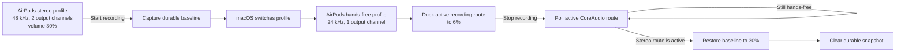

# Postmortem: Bluetooth output volume remained ducked after dictation

**Date:** 2026-07-26  
**Status:** Final  
**Related issues:** #38, #37  
**Repair PR:** #56

## Executive summary

Interview Arc Voice lowers background audio while recording. With AirPods Max, macOS changes the Bluetooth output from the normal stereo profile to a hands-free profile while the microphone is active, then changes it back after recording. The app treated both profiles as one route and stopped trying to restore the original volume after a fixed 350 ms delay.

During reproduction, the system volume began at 30%, correctly fell to 6% while recording, then incorrectly became 0% after the stereo profile returned. This made music effectively inaudible after dictation and allowed later microphone activity in another app to reveal the incorrect retained state.

The repair gives each output profile a route signature, captures the stereo baseline before microphone acquisition, ducks only after recording begins, and retains a durable restoration task until the original stereo profile actually returns.

No practice, transcript, or authentication data was lost.

## User impact

- Background audio could remain extremely quiet after stopping dictation.
- Starting or stopping dictation in another app could appear to change or “repair” the volume because it triggered another Bluetooth profile transition.
- The behavior was inconsistent because macOS profile-switch timing varied between recordings.
- A related recovery-popover transition could briefly clip the floating widget before Record again or Play began.

## Architecture and failure path

The previous implementation restored whichever route was visible after 350 ms and then deleted the snapshot. If the stereo profile returned after that point, the app no longer had the baseline needed to repair it.

## Detection and reproduction

The regression was reported after real AirPods Max use. We reproduced it against the installed packaged application, not only a development build.

Observed sequence:

| Stage | Active output profile | System volume |
|---|---|---:|
| Before recording | 48 kHz, 2 channels (stereo) | 30% |
| During recording | 24 kHz, 1 channel (hands-free) | 6% |
| After stopping, before repair | 48 kHz, 2 channels (stereo) | 0% |

The persisted background-audio snapshot had already been removed when the incorrect 0% state was observed. That proved restoration finished too early rather than merely failing to write the volume.

## Root cause

### Proximate cause

The controller identified an audio route primarily by device UID. AirPods can retain the same physical-device identity while CoreAudio exposes materially different stereo and hands-free output profiles. The controller therefore could not reliably distinguish the pre-recording route from the temporary recording route.

### Contributing factors

1. Restoration used a fixed 350 ms delay even though Bluetooth profile return is asynchronous and variable.
2. The restoration snapshot was cleared after one pass, regardless of whether the original profile had returned.
3. Ducking began before microphone acquisition, so a route transition could occur between baseline capture and the applied reduction.
4. Earlier verification did not assert the complete installed-app sequence across both CoreAudio profiles.
5. The recovery popover used a guessed delay rather than the popover’s actual close-completion event.

### Five whys

1. Why was music inaudible after recording?  
   The normal stereo route returned at an incorrect, heavily reduced volume.
2. Why was that volume not restored?  
   The restoration attempt had already completed and cleared its snapshot.
3. Why did restoration complete before the stereo route returned?  
   It waited a fixed 350 ms rather than observing the active route.
4. Why could it not identify the desired route reliably?  
   Route identity omitted profile characteristics such as sample rate and output-channel count.
5. Why was this not caught earlier?  
   Tests covered volume-policy arithmetic but not the real packaged app’s asynchronous Bluetooth profile lifecycle.

## Corrective changes

- A route signature now includes device UID, nominal sample rate, and output-channel count.
- The pre-recording stereo route is captured as a durable baseline before microphone acquisition.
- Ducking is applied after the recorder starts and the hands-free profile becomes active.
- Temporary adjusted profiles may be repaired early, but the baseline snapshot remains until the original profile is active and restored.
- Restoration polls quickly during the normal transition window and then continues at a lightweight interval rather than timing out.
- Interrupted-session recovery uses the same durable restoration path.
- Recovery-popover actions wait for the native popover-close notification; a timeout remains only as a safety fallback.

## Validation

Completed:

- Policy tests distinguish stereo and hands-free profiles belonging to the same Bluetooth device.
- Policy tests require the original profile before baseline restoration is considered complete.
- CI runs the complete Swift test suite and packages the application successfully.
- Local Swift parsing and repository consistency checks pass.

Installed-app verification:

- The installed binary matched the staged package from the passing macOS
  `test-and-package` run for the merged code.
- A real AirPods Max cycle produced 30% at 48 kHz / two-channel stereo,
  5–6% at 24 kHz / one-channel hands-free while recording, and 30% stereo
  after Stop.
- The restoration snapshot existed during recording and cleared after the
  original profile returned.
- Recovery → Record again entered Recording live at 00:01 with the complete
  capsule visible and no prior leading-edge crop.
- A repeat cycle briefly remained in the hands-free profile at 27% while
  another microphone holder was active; after release, it returned to 30%
  stereo and never retained the 5–6% ducked level.

The code commit passed the complete Swift test-and-package workflow. A later
documentation-only rerun did not start because GitHub Actions reported an
account billing/spending-limit block; no build or test step failed.

## Lessons learned

### What worked

- Inspecting the real CoreAudio profile characteristics made the route transition visible.
- Persisted snapshots provided evidence that state was being cleared prematurely.
- Reproducing with the installed package exposed behavior not represented by arithmetic-only unit tests.

### What did not work

- Treating a Bluetooth device UID as a complete output-route identity.
- Assuming a fixed delay represented operating-system completion.
- Declaring the regression fixed without validating the full packaged-app lifecycle.

## Preventive actions

| Priority | Action | Status |
|---|---|---|
| P0 | Keep a durable baseline until the original output profile is restored | Implemented in #56 |
| P0 | Validate the merged code artifact on real AirPods before closing #38 | Completed |
| P1 | Preserve route-profile regression tests in CI | Implemented in #56 |
| P1 | Use native completion events for recovery-popover actions | Implemented in #56 |
| P2 | Add diagnostic logging for route signatures and restoration state without recording sensitive audio | Follow-up |

## Terminology

- **A2DP:** Bluetooth stereo playback profile, represented here by the 48 kHz, two-channel route.
- **HFP/HSP:** Bluetooth hands-free/headset profile used while the headset microphone is active, represented here by the 24 kHz, one-channel route.
- **Ducking:** Temporarily reducing background-audio volume while recording.
- **Route signature:** Device UID plus sample rate and output-channel count, used to distinguish profiles of the same physical headset.
- **Durable snapshot:** Persisted pre-recording volume and route data retained until restoration truly completes.
